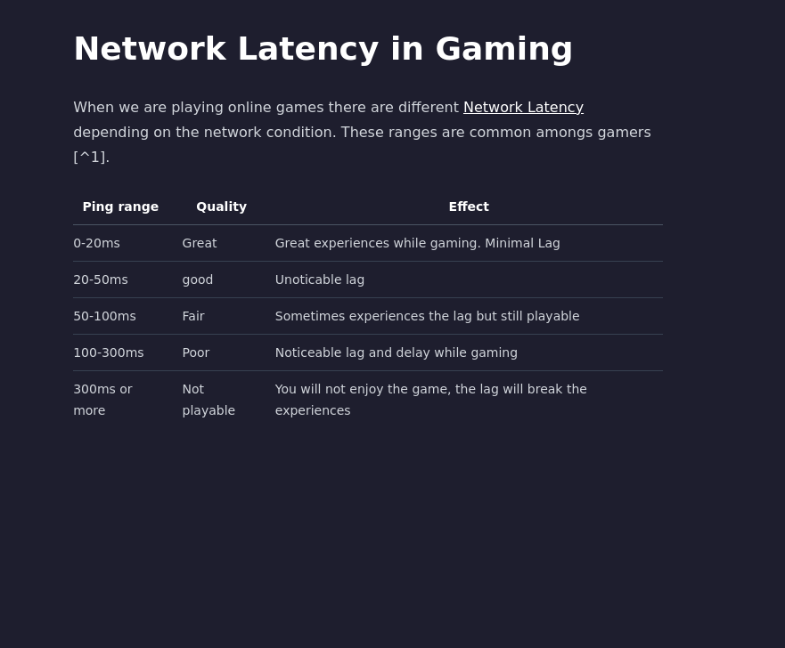

# The `markdown-it-footnote` broke when there's wiki-style linking

The example markdown code is:

```markdown
# Network Latency in Gaming

When we are playing online games there are different [[1721205710-OTMB|Network Latency]] depending on the network condition. These ranges are common amongs gamers [^1].

| Ping range    | Quality      | Effect                                                          |
| ------------- | ------------ | --------------------------------------------------------------- |
| 0-20ms        | Great        | Great experiences while gaming. Minimal Lag                     |
| 20-50ms       | good         | Unoticable lag                                                  |
| 50-100ms      | Fair         | Sometimes experiences the lag but still playable                |
| 100-300ms     | Poor         | Noticeable lag and delay while gaming                           |
| 300ms or more | Not playable | You will not enjoy the game, the lag will break the experiences |

[^1]: test. https://www.centurylink.com/home/help/internet/how-to-improve-gaming-latency.html
```

The resulted page:


